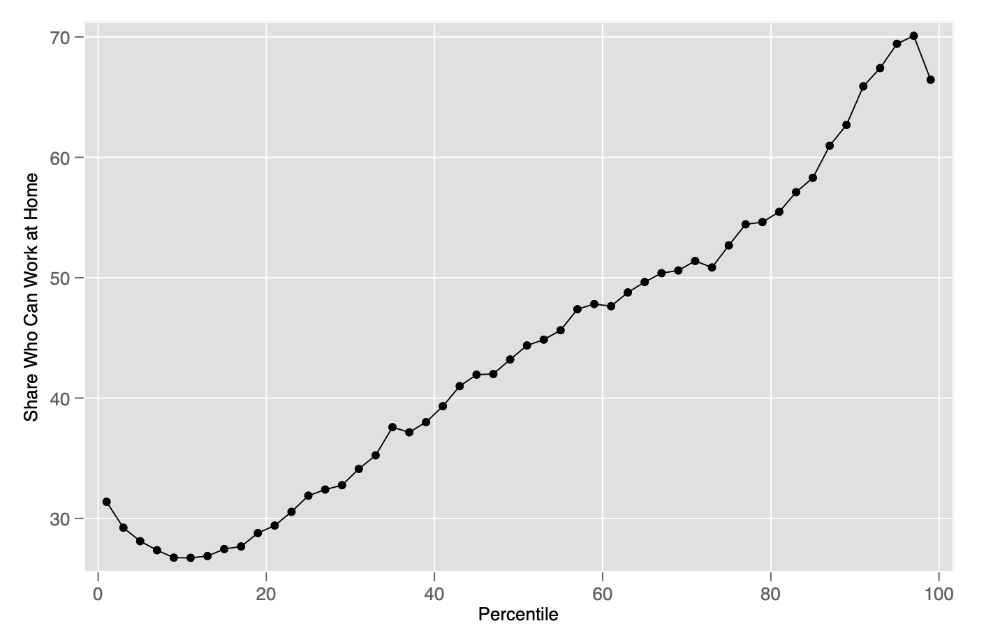

# who-can-work-from-home

Replication package for my IZA working paper titled "Who Can Work From Home".

### Introduction
In response to the COVID-19 pandemic, many states have adopted stay-at-home orders,
rendering a large segment of the workforce unable to continue doing their jobs. These
policies have distributional consequences, as workers in some occupations may be better
able to continue their work from home. I identify the segments of the U.S. workforce that
can plausibly work from home by linking occupation data from O*NET to the American
Community Survey. I find that lower-wage workers are up to three times less likely to be
able to work from home than higher-wage workers. Those with lower levels of education,
younger adults, ethnic minorities, and immigrants are also concentrated in occupations that are less likely to be performed from home.

### Main Result
<figcaption>Feasibility of Working from Home by Location in the Wage: Distribution</figcaption>

### Rerefence
https://www.iza.org/publications/dp/13197/who-can-work-from-home
